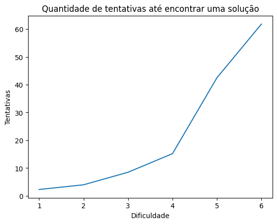

# Laboratório #3 -- Chamada de Procedimento Remoto (RPC)
## Integrantes: Bruno Menegaz, Gustavo Dutra, Leonardo Albergaria
---
## Instruções para Compilação e Execução

> Para realizar a instalação basta clonar o repositório para um diretório local e realizar a instalação do python caso ele não esteja na sua máquina. Também é necessário instalar as bibliotecas grpc e pybreaker caso não estejam na máquina.

> Em sequência, deve-se iniciar o servidor. Em Linux, a linha de comando ficará da seguinte forma:

```
$ python3 server_mine.py 
```

> Por fim, devem ser iniciados um ou mais clientes (utilizando um novo terminal para cada cliente). É necessário informar o endereço da porta do servidor, "[::]:8080", ao executar um cliente. A linha de comando ficará da seguinte forma:

```
$ python3 client.py [::]:8080
```

---
## Link para o vídeo no Drive


---
## Implementação
### **Server**
O servidor foi implementado com base na classe MineServer criada, que implementa o serviço definido no arquivo _.proto_. A tabela com os registros necessários foi implementada com um dicionário, que é criado quando a classe é instanciada, definindo automaticamente os registros relacionados ao primeiro desafio. Na _main_, é criado o servidor, sendo adicionado a ele o serviço apiServicer e a porta 8080, para que assim possa ser iniciado.

Em seguida, foram implementados os procedimentos remotos que os clientes poderão chamar. A maior parte dos métodos é simples, verificando se um _transactionID_ é válido e retornando as informações correspondentes a aquele ID. Foram criados métodos auxiliares para realizar essas verificações.

O método **_submitChallenge()_** realiza a validação de uma solução enviada por um cliente. Após verificar se a solução daquela transactionID ainda não foi encontrada, ela é passada na função de hash SHA-1, e em seguida é convertida em representação binária com a função **bin()**. Por fim, se os primeiros N bits dessa representação forem iguais a 0, a solução é válida, fazendo com que as informações correspondente sejam adicionadas à tabela e um novo desafio será lançado.

**Obs:** Aparentemente a função **bin()** retorna a representação binária com um prefixo que indica o sinal do número, fazendo com que a string de bits sempre inicie com 1. Por conta disso, na implementação da verificação o primeiro bit da sequência é sempre ignorado, caso contrário seria impossível encontrar uma solução.

### **Client**
O programa cliente é baseado em um menu com 7 itens, sendo os itens 1-6 as opções especificadas (getTransactionID, getChallenge, getTransactionStatus, getWinner, getSolution e Mine) e o item 7 a opção de sair. O cliente se conecta ao servidor a partir da porta passada, cria um stub da API do gRPC e então fica num loop infinito exibindo o menu com as opções disponíveis.

Assim como no server, a maioria das opções consistem em verificações simples. Já a opção **Mine** funciona da seguinte forma:

Ao verificar que o _transactionID_ é válido, o método auxiliar **lookForAnswer** é chamado. Este fica num loop infinito até que uma solução seja encontrada. A cada iteração, é gerada uma string '**solution**' com 10 caracteres aleatórios. É calculado um hash SHA-1 para a solução gerada, que é então convertido para representação binária. Por fim, é feita a verificação: se a sequência binária possuir os N primeiros bits iguais a 0, então **solution** é retornada e submetida ao servidor junto ao _transactionID_ e _clientID_.

---
## Testes
Para a realização dos testes, adicionamos um contador de tentativas de solução e também contamos o tempo gasto para tal.

Inicialmente, rodamos o servidor e um único cliente para observar o comportamento das tentativas até encontrar uma solução. Para cada valor do desafio (1 a 6), foi feita uma média de quantas tentativas foram feitas até encontrar uma solução para o desafio.


Analisando o gráfico, pudemos perceber que a quantidade de tentativas é consistente com a probabilidade de encontrar uma solução de acordo com cada dificuldade do desafio. As probabilidades são de 1/2, 1/4, 1/8, 1/16, 1/32 e 1/64, respectivamente, e os valores no gráfico mostram que a quantidade de tentativas necessárias foram proporcionais a essas probabilidades, ou seja, para a dificuldade 1 a solução é encontrada em média em 2 tentativas, enquanto para a dificuldade 6, são necessárias quase 62 tentativas, por exemplo.

Partindo então para os testes das chamadas de procedimento remoto propriamente ditas, conectamos 3 clientes